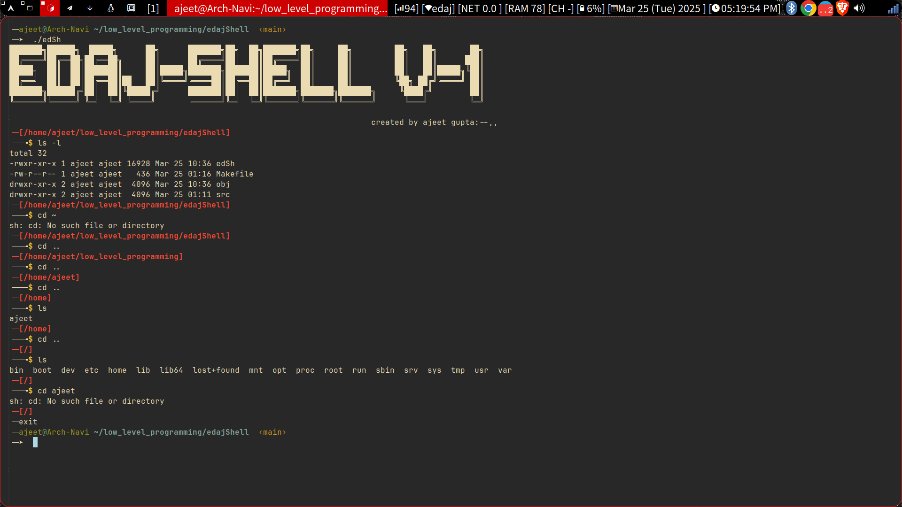

# Unix-edSh - A Minimalistic Shell

## Overview
edSh is a minimalistic shell i created from scratch in c. It provides a lightweight and straightforward command-line interface for executing shell commands right now it does not take pipes arguments will add in future , also it has some builtin
-commands which are native to shell not os.



## stuffs
- linux-system-calls
- gcc 


## Installation
To build and run Unix-edSh, follow these steps:

```sh
# Clone the repository
git clone https://github.com/yourusername/edSh.git
cd edSh

# Build the shell
make all

# Run the shell
./edSh
